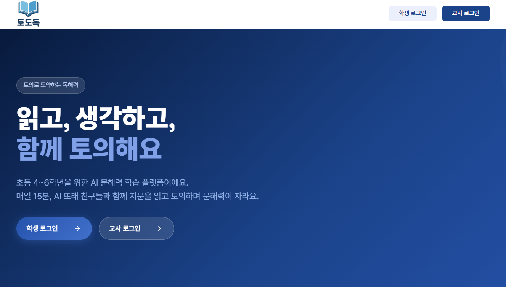
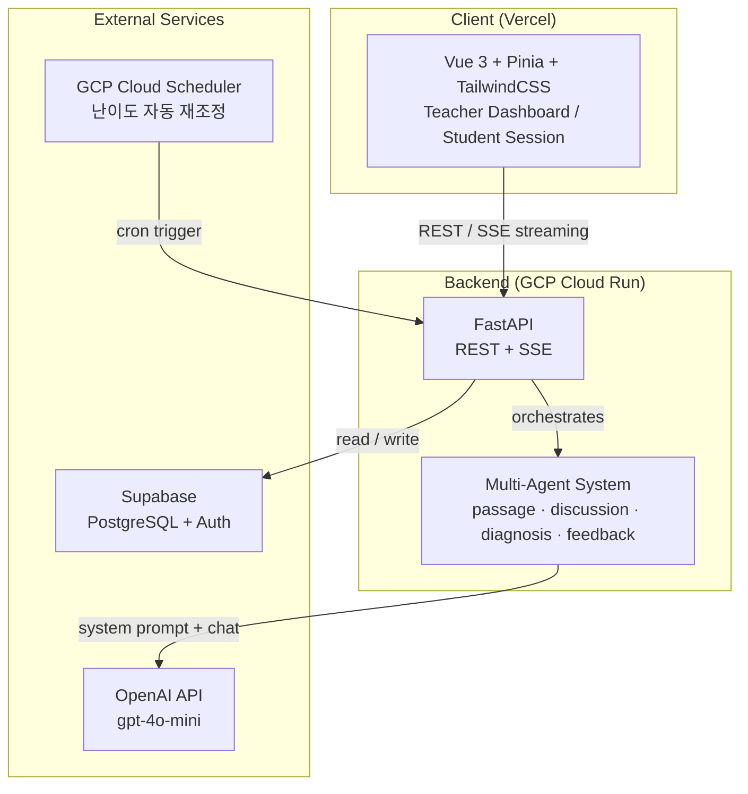

# Tododok — 멀티에이전트 기반 초개인화 문해력 교육 플랫폼



> **한 줄 요약:** 정답 확인으로 끝나는 기존 문해력 학습의 한계를 넘어, 또래 AI 에이전트와의 독서 토의로 초등학생의 추론·어휘·맥락 파악 능력을 향상시키는 교육 플랫폼

<div align="center">


</div>

## 목차

1. [개요](#1-개요)
2. [아키텍처](#2-아키텍처)
3. [프로젝트 구조](#3-프로젝트-구조)
4. [핵심 기능](#4-핵심-기능)
5. [트러블슈팅](#5-트러블슈팅)
6. [실행 방법](#6-실행-방법)
7. [유저 플로우 (테스트 가이드)](#7-유저-플로우-테스트-가이드)
8. [API 엔드포인트](#8-api-엔드포인트)
9. [DB 스키마](#9-db-스키마)
10. [CI/CD](#10-cicd)
11. [라이선스](#11-라이선스)

## 1. 개요

### 핵심 가치

또래 AI 에이전트 그룹과의 독서 토의를 통해 학생이 _왜_ 그렇게 생각했는지를 대화 기반으로 드러내고, **추론력·어휘력·맥락 파악** 세 축으로 개인 취약 영역을 정밀 진단합니다.

### 배포 URL

- **Frontend:** [https://liter-psi.vercel.app](https://liter-psi.vercel.app)
- **API Docs:** `{BACKEND_URL}/docs` (FastAPI Swagger UI)

### 사용자

| 사용자              | 목적                                       | 접속 방식                          |
| ------------------- | ------------------------------------------ | ---------------------------------- |
| 학생 (초등 4~6학년) | 매일 세션 수행, 문해력 향상, streak 유지   | 교사 발급 참여코드(join_code) 입력 |
| 담임교사            | 학급 모니터링, 취약 영역 확인, 난이도 조정 | 이메일 OTP 회원가입·로그인         |

## 2. 아키텍처



### 세션 흐름

1. 지문 읽기 (250~400자, 레벨별 난이도 조정)
2. 객관식 퀴즈 3문항 (정보 추출 / 추론 / 어휘)
3. AI 그룹 토의 (3라운드 고정)
4. 세션 종료 → 점수 산출 + 레벨 조정 + 취약 영역 업데이트

### 토의 구조 — 고정 턴 시퀀스

Director LLM 없이 **고정 시퀀스**로 턴을 결정합니다. 라운드당 4턴, 총 3라운드:

```
라운드당 턴 순서: ["moderator", "peer_a", "peer_b", "moderator"]

Step 0: 선생님 (사회자) — 주제 소개 / 전환 / 결론 안내
Step 1: 민지 (peer_a)  — 의견 / 반박 / 결론
Step 2: 준서 (peer_b)  — 민지에 반응 + 자기 의견
Step 3: 선생님 (정리)  — 실제 발언 요약 + 학생에게 질문
→ 학생 입력 대기 (wait_for_user)
× 3라운드 → 마무리 + 점수 산출
```

**라운드별 주제:**

| 라운드 | 주제        | 학생에게 요청        |
| ------ | ----------- | -------------------- |
| 1      | 의견 나누기 | 자기 의견 말하기     |
| 2      | 반박하기    | 다른 의견에 반박하기 |
| 3      | 결론 내기   | 최종 결론 정리하기   |

### 에이전트 캐릭터

| 역할      | 이름            | 성격                      | 프롬프트               |
| --------- | --------------- | ------------------------- | ---------------------- |
| moderator | 선생님 (사회자) | 중립적, 진행 역할, 존댓말 | `prompts/moderator.md` |
| peer_a    | 민지            | 적극적, 의견 주장형       | `prompts/peer_a.md`    |
| peer_b    | 준서            | 소극적, 질문형            | `prompts/peer_b.md`    |

## 3. 프로젝트 구조

```
KIT 바이브코딩 공모전/
├── backend/
│   ├── app/
│   │   ├── agents/                # AI 에이전트 로직
│   │   │   ├── discussion_agent.py  # 토의 에이전트 (moderator, peer_a, peer_b)
│   │   │   ├── passage_agent.py     # 지문 생성 에이전트
│   │   │   ├── diagnosis_agent.py   # 취약 영역 진단 에이전트
│   │   │   └── feedback_agent.py    # 피드백 생성 에이전트
│   │   ├── core/                  # 공통 모듈
│   │   │   ├── config.py            # 환경변수·설정 관리
│   │   │   ├── constants.py         # 상수 정의 (레벨, 제한 등)
│   │   │   ├── state.py             # 세션 상태 관리
│   │   │   ├── supabase.py          # Supabase 클라이언트
│   │   │   ├── llm_logging.py       # LLM 호출 로깅
│   │   │   ├── deps.py              # FastAPI 의존성 주입
│   │   │   └── dependencies.py      # 추가 의존성
│   │   ├── routers/               # API 라우터
│   │   │   ├── student/             # 학생 엔드포인트
│   │   │   │   ├── session.py         # 세션 생성·조회
│   │   │   │   ├── discussion.py      # SSE 토의 스트림
│   │   │   │   ├── turns.py           # 학생 발화 입력
│   │   │   │   └── scoring.py         # 점수 산출
│   │   │   ├── auth_student.py      # 학생 인증 (참여코드)
│   │   │   ├── auth_teacher.py      # 교사 인증 (OTP)
│   │   │   ├── teacher.py           # 교사 대시보드 API
│   │   │   └── internal.py          # 내부 cron 엔드포인트
│   │   ├── schemas/               # Pydantic 모델
│   │   │   ├── auth.py              # 인증 스키마
│   │   │   ├── session.py           # 세션 스키마
│   │   │   ├── llm.py               # LLM 관련 스키마
│   │   │   └── classroom.py         # 학급 스키마
│   │   ├── services/              # 비즈니스 로직
│   │   │   ├── discussion.py        # 토의 오케스트레이션 (고정 시퀀스)
│   │   │   └── director.py          # (레거시, 미사용)
│   │   └── main.py                # FastAPI 앱 정의
│   ├── prompts/                   # 에이전트 시스템 프롬프트 (.md)
│   │   ├── moderator.md
│   │   ├── peer_a.md
│   │   ├── peer_b.md
│   │   └── director.md              # (레거시)
│   ├── migrations/                # SQL 마이그레이션
│   │   ├── 001_p1_schema.sql
│   │   ├── 002_p11_enhanced_logging.sql
│   │   └── 003_add_timing_columns.sql
│   ├── scripts/
│   │   └── export_session.py        # 세션 데이터 내보내기
│   ├── tests/                     # 백엔드 테스트 (Pytest)
│   │   ├── test_director.py
│   │   └── test_p12_scenarios.py
│   ├── main.py                    # Cloud Run 진입점
│   ├── Dockerfile
│   └── requirements.txt
│
├── frontend/
│   ├── src/
│   │   ├── api/                   # API 클라이언트
│   │   │   ├── client.ts            # Axios 인스턴스 + 인터셉터
│   │   │   └── config.ts            # API URL 설정
│   │   ├── components/            # Vue 컴포넌트
│   │   │   └── discussion/          # 토의 UI 컴포넌트
│   │   │       ├── DiscussionHeader.vue
│   │   │       ├── DiscussionMessageList.vue
│   │   │       ├── DiscussionInput.vue
│   │   │       └── types.ts
│   │   ├── composables/           # Composition API 훅
│   │   │   └── useDiscussionStream.ts # SSE 스트림 처리
│   │   ├── pages/                 # 라우트 페이지
│   │   │   ├── LandingPage.vue      # 랜딩 (역할 선택)
│   │   │   ├── StudentOnboarding.vue  # 학생 참여코드 입력
│   │   │   ├── StudentHome.vue      # 학생 홈 (세션 시작)
│   │   │   ├── StudentSession.vue   # 지문 읽기 + 퀴즈
│   │   │   ├── StudentDiscussion.vue  # AI 그룹 토의
│   │   │   ├── StudentResult.vue    # 결과 확인
│   │   │   ├── TeacherDashboardPage.vue
│   │   │   └── teacher/
│   │   │       ├── TeacherAuthPage.vue      # 교사 로그인/가입
│   │   │       └── TeacherClassroomsPage.vue  # 학급 목록
│   │   ├── router/
│   │   │   └── index.ts             # Vue Router 설정
│   │   ├── stores/                # Pinia 상태 관리
│   │   │   ├── student.ts           # 학생 인증·프로필
│   │   │   ├── teacher.ts           # 교사 인증·프로필
│   │   │   ├── session.ts           # 세션 상태
│   │   │   └── discussion.ts        # 토의 메시지·상태
│   │   ├── lib/                   # 유틸리티
│   │   ├── assets/                # 정적 자산
│   │   ├── App.vue
│   │   └── main.ts
│   ├── e2e/                       # Playwright E2E 테스트
│   │   ├── student.flow.spec.ts     # 학생 세션 플로우
│   │   ├── teacher.flow.spec.ts     # 교사 대시보드 플로우
│   │   ├── fixtures/
│   │   └── helpers/
│   ├── public/
│   ├── index.html
│   ├── package.json
│   ├── vite.config.ts
│   ├── vercel.json
│   ├── playwright.config.ts
│   └── tsconfig.json
│
├── docs/
│   └── sse_protocol.md              # SSE 프로토콜 문서
├── .github/
│   └── workflows/
│       ├── deploy-backend.yml       # Backend CI/CD
│       └── deploy-frontend.yml      # Frontend CI/CD
├── CLAUDE.md
├── LICENSE.md                       # MIT License
└── README.md
```

## 4. 핵심 기능

### 4.1 AI 지문 생성

학생의 현재 레벨(1~3)에 맞춰 250~400자 분량의 지문을 `gpt-4o-mini`로 동적 생성합니다. 정보 추출·추론·어휘 3가지 관점의 객관식 퀴즈도 함께 생성됩니다.

### 4.2 멀티 에이전트 그룹 토의

3명의 AI 에이전트(선생님, 민지, 준서)가 학생과 함께 지문에 대해 토의합니다.

- **에이전트 독립 호출**: 역할 혼동 방지를 위해 에이전트 간 대화 컨텍스트를 공유하지 않음
- **고정 턴 시퀀스**: LLM 없이 `ROUND_SPEAKERS` 배열로 발화 순서 결정
- **SSE 실시간 스트리밍**: `fetch + ReadableStream` 방식으로 토의 내용을 실시간 전달
- **Soft Interrupt**: 학생이 AI 발화 도중 끼어들면 큐에 저장 후 다음 라운드로 전진

### 4.3 개인화 진단 및 레벨 조정

- 세션 종료 시 추론·어휘·맥락 파악 점수를 산출하고 취약 영역(`weak_areas`)을 업데이트
- 최근 3세션 평균 점수 기준으로 자동 레벨 조정 (GCP Cloud Scheduler)
- 교사가 수동 설정한 레벨은 `is_manual_override` 플래그로 보호

### 4.4 교사 대시보드

학급 단위로 학생별 레벨, 취약 영역, 세션 이력을 모니터링하고 난이도를 수동 조정할 수 있습니다.

## 5. 트러블슈팅

### 멀티 에이전트 토의 — 인격 충돌 방지

- **문제:** 세 AI가 같은 API 컨텍스트를 공유하면서 역할이 뒤섞이고, 한 에이전트가 다른 에이전트의 발언을 반복
- **해결:** 에이전트별 system prompt 완전 분리 (각 호출은 독립 컨텍스트), 발화 순서를 백엔드가 강제 직렬화

### 모더레이터 의견 Hallucination

- **문제:** 모더레이터가 아직 발언하지 않은 참여자의 의견을 미리 지어내서 요약
- **해결:** Step 3 (정리) instruction에 실제 발언 내용을 직접 주입하여 hallucination 방지

### 기계적 반대 패턴

- **문제:** "절반 이상 반대하라"는 프롬프트 규칙 때문에 내용 무관하게 반대만 반복
- **해결:** 규칙 제거, 내용 기반 자연스러운 반응(공감/반대/보충)으로 변경

### 세션 중복 생성 (Double Submit)

- **문제:** 네트워크 지연 시 버튼 연속 클릭으로 세션 2개 이상 생성 → 일일 한도 즉시 소진
- **해결:** async 핸들러 첫 줄에 `if (loading.value) return` 가드, Pinia store에서 loading 상태 단일 관리

### 레벨 수동 설정 덮어쓰기

- **문제:** cron 자동 조정이 교사의 수동 레벨 설정을 무시
- **해결:** `is_manual_override` 플래그 추가, 자동 조정 시 해당 학생 건너뜀

### Director LLM 제거

- **문제:** 턴 순서가 고정인데 LLM으로 결정 → 불필요한 비용 + guard가 어차피 덮어씀
- **해결:** Director LLM 제거, `_next_decision()` 함수에서 `ROUND_SPEAKERS` 배열 인덱싱으로 대체

## 6. 실행 방법

### 필수 환경 변수

| 변수                        | 설명                                  | 필요 위치 |
| --------------------------- | ------------------------------------- | --------- |
| `SUPABASE_URL`              | Supabase 프로젝트 URL                 | Backend   |
| `SUPABASE_ANON_KEY`         | Supabase anon public key              | Backend   |
| `SUPABASE_SERVICE_ROLE_KEY` | Supabase service role key (서버 전용) | Backend   |
| `OPENAI_API_KEY`            | OpenAI API 키                         | Backend   |
| `JWT_SECRET`                | JWT 서명 비밀키                       | Backend   |
| `APP_ENV`                   | 실행 환경 (`dev` / `prod`)            | Backend   |
| `VITE_API_BASE_URL`         | 프론트에서 바라볼 백엔드 URL          | Frontend  |

### Local 개발

```bash
# Backend
cd backend
pip install -r requirements.txt
# .env 파일 생성 후 위 환경 변수 설정
uvicorn app.main:app --reload    # http://localhost:8000

# Frontend
cd frontend
npm install
# .env.local 파일에 VITE_API_BASE_URL=http://localhost:8000 설정
npm run dev                       # http://localhost:5173
```

## 7. 유저 플로우 (테스트 가이드)

배포 환경(`liter-psi.vercel.app`) 또는 로컬(`localhost:5173`)에서 아래 순서로 테스트합니다.

### 교사 플로우

1. 랜딩 페이지에서 **교사** 역할 선택
2. 이메일 입력 → 회원가입 → 수신된 OTP 6자리 입력하여 인증
3. 로그인 후 **학급 생성** → 자동 발급된 **참여코드**(join_code) 확인
4. 대시보드에서 학생별 레벨, 취약 영역, 세션 이력 조회
5. 필요 시 학생 레벨 수동 조정 (자동 레벨 조정에 우선)

### 학생 플로우

1. 랜딩 페이지에서 **학생** 역할 선택
2. 교사에게 받은 **참여코드** + 이름 입력 → 자동 로그인
3. 홈 화면에서 **오늘의 학습 시작** 클릭 (일일 3회 제한)
4. **지문 읽기** — AI가 레벨에 맞춰 생성한 250~400자 지문을 읽음
5. **퀴즈 풀기** — 정보 추출 / 추론 / 어휘 객관식 3문항에 답안 제출
6. **AI 그룹 토의** — 선생님(사회자), 민지, 준서와 3라운드 토의 진행
   - 라운드 1: AI들이 의견을 나눈 뒤 학생에게 질문 → 학생이 자기 의견 입력
   - 라운드 2: AI들이 서로 반박한 뒤 학생에게 반박 요청 → 학생이 반박 입력
   - 라운드 3: AI들이 결론을 말한 뒤 학생에게 최종 정리 요청 → 학생이 결론 입력
7. **결과 확인** — 추론·어휘·맥락 파악 점수, 피드백, streak 확인

### 테스트 체크리스트

- [ ] 교사 가입 → 학급 생성 → 참여코드 발급까지 정상 동작
- [ ] 학생이 참여코드로 입장 후 세션 시작 가능
- [ ] 지문·퀴즈가 정상 생성되고, 답안 제출이 동작
- [ ] 토의 SSE 스트림이 끊기지 않고 3라운드 완료
- [ ] 각 라운드에서 학생 입력 후 다음 라운드로 전환
- [ ] 세션 종료 후 점수·피드백이 표시
- [ ] 일일 3회 세션 제한이 동작
- [ ] 교사 대시보드에서 완료된 세션 데이터가 반영

## 8. API 엔드포인트

전체 API 스펙은 `{BACKEND_URL}/docs` (Swagger UI)에서 확인할 수 있습니다.

| Method | Path                                             | 설명                  |
| ------ | ------------------------------------------------ | --------------------- |
| `POST` | `/api/v1/auth/teacher/signup`                    | 교사 회원가입         |
| `POST` | `/api/v1/auth/teacher/verify-otp`                | 교사 OTP 인증         |
| `POST` | `/api/v1/auth/student/join`                      | 학생 참여코드 → JWT   |
| `GET`  | `/api/v1/student/me`                             | 학생 프로필 조회      |
| `POST` | `/api/v1/student/sessions`                       | 세션 시작             |
| `POST` | `/api/v1/student/sessions/{id}/answers`          | 퀴즈 답안 제출        |
| `GET`  | `/api/v1/student/sessions/{id}/discussion`       | SSE 토의 스트림       |
| `POST` | `/api/v1/student/sessions/{id}/discussion/turns` | 학생 발화 입력        |
| `GET`  | `/api/v1/teacher/classrooms`                     | 학급 목록 조회        |
| `GET`  | `/api/v1/teacher/classrooms/{id}`                | 학급 상세 + 학생 분석 |

## 9. DB 스키마

```
students       — id, name, level, streak_count, weak_areas[], classroom_id, is_manual_override
sessions       — id, student_id, status, passage_content, question_results, scores, feedback
messages       — id, session_id, speaker, content, round, role, intent, target
director_calls — id, session_id, round, input_state, decision, latency_ms, cost_usd
llm_calls      — id, session_id, agent, model, latency_ms, tokens
classrooms     — id, teacher_id, name, join_code
teachers       — id, email, password_hash, classroom_id
```

## 10. CI/CD

GitHub Actions로 `backend/**` 변경 시 GCP Cloud Run, `frontend/**` 변경 시 Vercel에 자동 배포됩니다.

- 단위 테스트: `backend/tests/` (Pytest)
- E2E 테스트: `frontend/e2e/` (Playwright)

## 11. 라이선스

[MIT License](LICENSE.md) &copy; 2026 HJO
